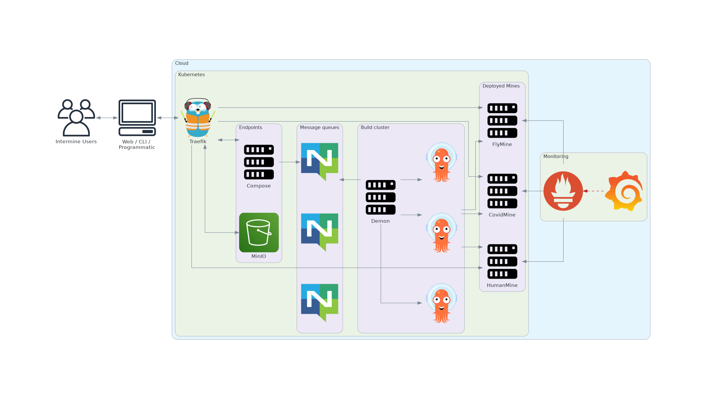

Local - Kubernetes
==================

``kind`` is used to create a local kubernetes cluster.
Once the cluster is created  ``flux`` is used to install InterMine Cloud components inside the local cluster using the ``Kustomize`` scripts.
``flux`` also continuosly watches a respository hosted inside the local cluster (using ``Gitea``) for changes to update the cluster state.
This repositiory is in sync with the project files repository.
So, an end user never interacts with the local cluster directly.
Changes are made to files in the generated project directory and pushed to the repository hosted inside the cluster.
These changes are picked up by ``flux`` and applied to the cluster.

    